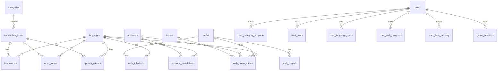

# Waffley Database Schema Design

A forward-looking schema for migrating from localStorage to PostgreSQL. Designed with normalisation, mobile app support, and future extensibility in mind. This is a design document -- no migration or implementation yet.

---

## Entity-Relationship Overview



---

## Content Tables

### `languages`

```sql
CREATE TABLE languages (
    id          SMALLSERIAL PRIMARY KEY,
    code        VARCHAR(5) NOT NULL UNIQUE,   -- 'es', 'fr', 'de', etc.
    name        VARCHAR(50) NOT NULL,         -- 'Spanish', 'French'
    flag        VARCHAR(10) NOT NULL,         -- emoji flag
    speech_code VARCHAR(10) NOT NULL,         -- 'es-ES', 'fr-FR'
    supports_verbs BOOLEAN NOT NULL DEFAULT TRUE,
    created_at  TIMESTAMPTZ NOT NULL DEFAULT NOW()
);
```

Small reference table, rarely changes. `code` is the natural key; surrogate PK for FK join efficiency.

### `categories`

```sql
CREATE TABLE categories (
    id           SMALLSERIAL PRIMARY KEY,
    slug         VARCHAR(30) NOT NULL UNIQUE,  -- 'colours', 'animals', etc.
    label        VARCHAR(50) NOT NULL,         -- 'Colours', 'Animals'
    icon         VARCHAR(10) NOT NULL,         -- emoji icon
    display_type VARCHAR(10) NOT NULL DEFAULT 'emoji',  -- 'emoji' | 'color'
    is_noun      BOOLEAN NOT NULL DEFAULT FALSE,
    is_adjective BOOLEAN NOT NULL DEFAULT FALSE,
    sort_order   SMALLINT NOT NULL DEFAULT 0
);
```

`is_noun` and `is_adjective` flags replace the current `NOUN_CATEGORIES` array and `ADJECTIVE_CATEGORY` constant, making form availability data-driven.

### `vocabulary_items`

```sql
CREATE TABLE vocabulary_items (
    id            SERIAL PRIMARY KEY,
    category_id   SMALLINT NOT NULL REFERENCES categories(id),
    item_key      VARCHAR(30) NOT NULL,           -- 'dog', 'red', 'happy'
    display_value VARCHAR(30) NOT NULL,           -- emoji or CSS hex '#dc3545'
    sort_order    SMALLINT NOT NULL DEFAULT 0,
    UNIQUE (category_id, item_key)
);
```

Combines the current `items` arrays, `display` maps, and `COLOR_CSS` into one normalised table. `display_value` holds either an emoji or a CSS colour code, interpreted by the client based on `categories.display_type`.

### `translations`

```sql
CREATE TABLE translations (
    id          SERIAL PRIMARY KEY,
    item_id     INTEGER NOT NULL REFERENCES vocabulary_items(id),
    language_id SMALLINT NOT NULL REFERENCES languages(id),
    text        VARCHAR(100) NOT NULL,            -- 'Chien', 'Perro', 'Hund'
    UNIQUE (item_id, language_id)
);
CREATE INDEX idx_translations_lang ON translations(language_id);
```

One row per item per language. The UNIQUE constraint prevents duplicates.

### `word_forms`

```sql
CREATE TABLE word_forms (
    id          SERIAL PRIMARY KEY,
    item_id     INTEGER NOT NULL REFERENCES vocabulary_items(id),
    language_id SMALLINT NOT NULL REFERENCES languages(id),
    form_type   VARCHAR(20) NOT NULL,             -- 'article', 'plural', 'plural_article', 'feminine'
    text        VARCHAR(100) NOT NULL,
    UNIQUE (item_id, language_id, form_type)
);
CREATE INDEX idx_word_forms_item_lang ON word_forms(item_id, language_id);
```

Each form variant (article "Le", plural "Chiens", pluralArticle "Les", feminine "Heureuse") is a separate row. Extensible -- adding a new form type (e.g. "diminutive") requires no schema change.

### `speech_aliases`

```sql
CREATE TABLE speech_aliases (
    id          SERIAL PRIMARY KEY,
    item_id     INTEGER NOT NULL REFERENCES vocabulary_items(id),
    language_id SMALLINT NOT NULL REFERENCES languages(id),
    alias       VARCHAR(100) NOT NULL,
    UNIQUE (item_id, language_id, alias)
);
CREATE INDEX idx_speech_aliases_item_lang ON speech_aliases(item_id, language_id);
```

Maps accepted speech recognition variants. One row per alias.

### `colour_cycle_pools`

```sql
CREATE TABLE colour_cycle_pools (
    id       SERIAL PRIMARY KEY,
    cycle    SMALLINT NOT NULL,
    item_id  INTEGER NOT NULL REFERENCES vocabulary_items(id),
    UNIQUE (cycle, item_id)
);
```

Replaces `CYCLE_COLORS` and `NEW_COLORS_PER_CYCLE` constants. Makes colour pool expansion data-driven.

---

## Verb Tables

### `verbs`

```sql
CREATE TABLE verbs (
    id         SMALLSERIAL PRIMARY KEY,
    verb_key   VARCHAR(20) NOT NULL UNIQUE,       -- 'be', 'have', 'go'
    emoji      VARCHAR(10) NOT NULL,
    sort_order SMALLINT NOT NULL DEFAULT 0
);
```

### `verb_english`

```sql
CREATE TABLE verb_english (
    id          SERIAL PRIMARY KEY,
    verb_id     SMALLINT NOT NULL REFERENCES verbs(id),
    pronoun_key VARCHAR(10) NOT NULL,             -- 'I', 'you', 'he', etc.
    text        VARCHAR(50) NOT NULL,             -- 'I am', 'You are', etc.
    UNIQUE (verb_id, pronoun_key)
);
```

English conjugation prompts shown to the user during learning.

### `pronouns`

```sql
CREATE TABLE pronouns (
    id          SMALLSERIAL PRIMARY KEY,
    pronoun_key VARCHAR(10) NOT NULL UNIQUE,       -- 'I', 'you', 'he', 'we', 'you_pl', 'they'
    label       VARCHAR(20) NOT NULL,              -- 'I', 'You', 'He/She', etc.
    sort_order  SMALLINT NOT NULL DEFAULT 0
);
```

### `pronoun_translations`

```sql
CREATE TABLE pronoun_translations (
    id          SERIAL PRIMARY KEY,
    pronoun_id  SMALLINT NOT NULL REFERENCES pronouns(id),
    language_id SMALLINT NOT NULL REFERENCES languages(id),
    text        VARCHAR(50) NOT NULL,              -- 'Je', 'Tu', 'Yo', etc.
    UNIQUE (pronoun_id, language_id)
);
```

### `tenses`

```sql
CREATE TABLE tenses (
    id        SMALLSERIAL PRIMARY KEY,
    tense_key VARCHAR(20) NOT NULL UNIQUE,         -- 'present', 'past', 'future'
    label     VARCHAR(30) NOT NULL,
    sort_order SMALLINT NOT NULL DEFAULT 0
);
```

Only "present" exists now, but designing for future tense expansion avoids a schema migration later.

### `verb_infinitives`

```sql
CREATE TABLE verb_infinitives (
    id          SERIAL PRIMARY KEY,
    verb_id     SMALLINT NOT NULL REFERENCES verbs(id),
    language_id SMALLINT NOT NULL REFERENCES languages(id),
    infinitive  VARCHAR(50) NOT NULL,
    UNIQUE (verb_id, language_id)
);
```

Infinitives separated from conjugations since they are not pronoun-dependent.

### `verb_conjugations`

```sql
CREATE TABLE verb_conjugations (
    id          SERIAL PRIMARY KEY,
    verb_id     SMALLINT NOT NULL REFERENCES verbs(id),
    language_id SMALLINT NOT NULL REFERENCES languages(id),
    tense_id    SMALLINT NOT NULL REFERENCES tenses(id),
    pronoun_id  SMALLINT NOT NULL REFERENCES pronouns(id),
    conjugation VARCHAR(100) NOT NULL,
    UNIQUE (verb_id, language_id, tense_id, pronoun_id)
);
CREATE INDEX idx_verb_conj_lang_tense ON verb_conjugations(language_id, tense_id);
```

The data is a 4-dimensional matrix (verb x pronoun x language x tense). A single flat table with composite UNIQUE constraint is the cleanest normalised representation.

---

## User Tables

### `users`

```sql
CREATE TABLE users (
    id              UUID PRIMARY KEY DEFAULT gen_random_uuid(),
    display_name    VARCHAR(100),
    email           VARCHAR(255) UNIQUE,
    auth_provider   VARCHAR(20),                   -- 'google', 'apple', 'email', 'anonymous'
    created_at      TIMESTAMPTZ NOT NULL DEFAULT NOW(),
    last_active_at  TIMESTAMPTZ NOT NULL DEFAULT NOW(),
    preferences     JSONB NOT NULL DEFAULT '{}'::JSONB  -- audio settings, SFX mute, etc.
);
CREATE INDEX idx_users_email ON users(email) WHERE email IS NOT NULL;
```

UUID PK for mobile-friendly distributed ID generation. `preferences` as JSONB avoids a separate settings table for simple key-value pairs. Anonymous users are supported for the current localStorage-like experience.

### `user_category_progress`

```sql
CREATE TABLE user_category_progress (
    id                    SERIAL PRIMARY KEY,
    user_id               UUID NOT NULL REFERENCES users(id) ON DELETE CASCADE,
    language_id           SMALLINT NOT NULL REFERENCES languages(id),
    category_id           SMALLINT NOT NULL REFERENCES categories(id),
    total_correct_answers INTEGER NOT NULL DEFAULT 0,
    current_cycle         SMALLINT NOT NULL DEFAULT 1,
    levels_completed      INTEGER NOT NULL DEFAULT 0,
    updated_at            TIMESTAMPTZ NOT NULL DEFAULT NOW(),
    UNIQUE (user_id, language_id, category_id)
);
CREATE INDEX idx_ucp_user ON user_category_progress(user_id);
```

Direct mapping from the current `waffley_progress.languages[key]` structure. One row per user per language per category. The most frequently read/written table.

### `user_verb_progress`

```sql
CREATE TABLE user_verb_progress (
    id               SERIAL PRIMARY KEY,
    user_id          UUID NOT NULL REFERENCES users(id) ON DELETE CASCADE,
    language_id      SMALLINT NOT NULL REFERENCES languages(id),
    tense_id         SMALLINT NOT NULL REFERENCES tenses(id),
    total_correct_answers INTEGER NOT NULL DEFAULT 0,
    levels_completed INTEGER NOT NULL DEFAULT 0,
    current_cycle    SMALLINT NOT NULL DEFAULT 1,
    updated_at       TIMESTAMPTZ NOT NULL DEFAULT NOW(),
    UNIQUE (user_id, language_id, tense_id)
);
```

Verb mode progress tracked separately. Includes `tense_id` for future tense support.

### `user_stats`

```sql
CREATE TABLE user_stats (
    id             SERIAL PRIMARY KEY,
    user_id        UUID NOT NULL REFERENCES users(id) ON DELETE CASCADE,
    best_streak    INTEGER NOT NULL DEFAULT 0,
    highest_cycle  SMALLINT NOT NULL DEFAULT 1,
    games_played   INTEGER NOT NULL DEFAULT 0,
    updated_at     TIMESTAMPTZ NOT NULL DEFAULT NOW(),
    UNIQUE (user_id)
);
```

### `user_language_stats`

```sql
CREATE TABLE user_language_stats (
    id          SERIAL PRIMARY KEY,
    user_id     UUID NOT NULL REFERENCES users(id) ON DELETE CASCADE,
    language_id SMALLINT NOT NULL REFERENCES languages(id),
    correct     INTEGER NOT NULL DEFAULT 0,
    games       INTEGER NOT NULL DEFAULT 0,
    updated_at  TIMESTAMPTZ NOT NULL DEFAULT NOW(),
    UNIQUE (user_id, language_id)
);
CREATE INDEX idx_uls_user ON user_language_stats(user_id);
```

### `user_item_mastery` (for future spaced repetition)

```sql
CREATE TABLE user_item_mastery (
    id              SERIAL PRIMARY KEY,
    user_id         UUID NOT NULL REFERENCES users(id) ON DELETE CASCADE,
    item_id         INTEGER NOT NULL REFERENCES vocabulary_items(id),
    language_id     SMALLINT NOT NULL REFERENCES languages(id),
    form_type       VARCHAR(20) NOT NULL DEFAULT 'base',
    correct_streak  SMALLINT NOT NULL DEFAULT 0,
    total_correct   INTEGER NOT NULL DEFAULT 0,
    total_attempts  INTEGER NOT NULL DEFAULT 0,
    last_seen_at    TIMESTAMPTZ,
    UNIQUE (user_id, item_id, language_id, form_type)
);
CREATE INDEX idx_uim_user_lang ON user_item_mastery(user_id, language_id);
```

Currently mastery is ephemeral (resets on level-up). This table enables persistent spaced-repetition data, critical for a mobile app where sessions are short and resumable.

### `game_sessions` (for analytics)

```sql
CREATE TABLE game_sessions (
    id              UUID PRIMARY KEY DEFAULT gen_random_uuid(),
    user_id         UUID NOT NULL REFERENCES users(id) ON DELETE CASCADE,
    language_id     SMALLINT NOT NULL REFERENCES languages(id),
    category_id     SMALLINT REFERENCES categories(id),  -- NULL for verb mode
    mode            VARCHAR(10) NOT NULL,                 -- 'words' | 'verbs'
    phase           VARCHAR(20) NOT NULL,                 -- 'Learning', 'Practice', 'Typing', 'Speech'
    score           INTEGER NOT NULL DEFAULT 0,
    total_questions INTEGER NOT NULL DEFAULT 0,
    avg_response_ms INTEGER,
    started_at      TIMESTAMPTZ NOT NULL DEFAULT NOW(),
    ended_at        TIMESTAMPTZ
);
CREATE INDEX idx_sessions_user ON game_sessions(user_id);
CREATE INDEX idx_sessions_user_time ON game_sessions(user_id, started_at DESC);
```

Session-level analytics for engagement patterns. Essential for mobile push notification re-engagement.

---

## Normalisation Choices

- **3NF achieved**: Every non-key column depends on the whole key and nothing but the key. Translations, forms, aliases, and conjugations are all in separate tables keyed by composite natural keys.

- **`word_forms` as a separate table**: Different categories have different form types (nouns: article/plural/pluralArticle; adjectives: feminine). An EAV-style `form_type` column avoids NULL-heavy wide tables and allows adding new form types without ALTER TABLE.

- **`verb_conjugations` as a join table**: The data is a multi-dimensional matrix (verb x pronoun x language x tense). A single flat table with composite UNIQUE is the cleanest normalised representation.

- **Surrogate vs natural keys**: Integer/smallint surrogate PKs on all tables for FK join performance. Natural UNIQUE constraints (e.g. `languages.code`, `vocabulary_items(category_id, item_key)`) preserved for data integrity.

- **User preferences as JSONB**: A deliberate denormalisation. Settings like `{ audioEnabled: true, sfxMuted: false }` are read/written atomically and never queried across users.

---

## Performance Considerations

### Read-heavy content

Content tables (languages, categories, vocabulary_items, translations, word_forms, verb_conjugations) are essentially read-only after seeding. The entire content dataset is small (~2000 rows). Should be aggressively cached at the application layer with a long TTL or loaded into memory on app start.

### Materialised vocabulary view

For the hot path (loading a category's vocabulary for a language), avoid repeated multi-table joins:

```sql
CREATE MATERIALIZED VIEW mv_category_vocabulary AS
SELECT vi.id, vi.item_key, vi.display_value, vi.category_id,
       c.slug AS category_slug, c.display_type,
       t.text AS translation, t.language_id,
       l.code AS language_code
FROM vocabulary_items vi
JOIN categories c ON c.id = vi.category_id
JOIN translations t ON t.item_id = vi.id
JOIN languages l ON l.id = t.language_id;
```

Refresh on content updates only (rare).

### Write path

Only user tables are written during gameplay. `user_category_progress` and `user_stats` are UPSERTed (`INSERT ... ON CONFLICT UPDATE`). Batch writes at session end rather than per-answer to reduce round-trips.

### Indexes

All FK columns are indexed. Composite indexes on `(user_id, language_id)` for progress queries. Partial index on `users.email` (WHERE NOT NULL) to save space for anonymous users.

### Scaling

- Connection pooling (PgBouncer or Supabase) for mobile app connections
- `game_sessions` can be range-partitioned by `started_at` month if analytics volume grows

---

## Mobile App Considerations

### Offline-first architecture

Ship a bundled SQLite database containing all content tables. User progress is written to local SQLite first, then synced to PostgreSQL when online.

### Sync strategy

Last-write-wins on progress tables using `updated_at` timestamps. Conflict resolution: take the row with the higher `levels_completed` or `total_correct_answers` to avoid regressing progress.

### UUID primary keys

Allow offline-generated user IDs without central coordination. No sequence conflicts across devices.

### API design

```
GET  /api/content/categories/:lang   -- full vocabulary + translations + forms (cacheable)
GET  /api/content/verbs/:lang        -- verb conjugations for a language (cacheable)
GET  /api/users/:id/progress         -- all progress for a user
PUT  /api/users/:id/progress         -- upserts category/verb progress
POST /api/users/:id/sessions         -- records a completed game session
```

Content payload for one language (~11 items x 5 categories x ~4 forms = ~220 rows) is under 20KB JSON. Ship all languages in the app bundle; sync progress only.

### Anonymous-to-authenticated migration

User starts anonymous (UUID created locally). On sign-up, their UUID is retained and `email`/`auth_provider` populated. All progress preserved.

### Re-engagement

`game_sessions.ended_at` and `users.last_active_at` enable notification queries (e.g. "users inactive for 3+ days").

---

## Migration Path from localStorage

1. On first authenticated login, read `waffley_progress` and `waffley_stats` from localStorage
2. Map language codes and category names to database IDs
3. INSERT into `user_category_progress`, `user_verb_progress`, `user_stats`, `user_language_stats`
4. Clear localStorage after successful migration
5. Provide a "sync from device" button for multi-device users
